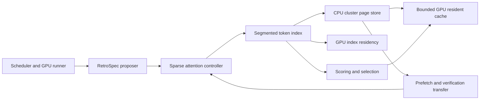

# RetroSpec CPU offload backend

RetroSpec on `version1` keeps cluster pages in CPU memory and uses a bounded
GPU resident cache. The active implementation is under
`vllm/v1/spec_decode/retrospec/offload/`. The runtime controllers remain in
`vllm/v1/spec_decode/retrospec/runtime/`; they enter the backend through
`RetroSpecSegmentedTokenIndex` and its page store.

## Package responsibilities

| Modules under `offload/` | Responsibility |
| --- | --- |
| `segmented_index.py`, `segmented_build.py`, `segmented_selection.py`, `segmented_verification.py`, `segmented_types.py` | Per-request segment state, background index construction, selection plans, indexed verification, and full verification pipeline |
| `cluster_store.py`, `cluster_store_metadata.py`, `cluster_store_support.py`, `cluster_staging_types.py`, `cluster_verification_types.py`, `page_pool.py` | Cluster page ownership, stable-handle lifecycle and infrequent metadata queries, prefetch state, pinned and GPU staging buffers, verification descriptors and resolved page types, and CPU page slabs |
| `cluster_prefetch.py`, `cluster_verification.py`, `verification_transfer.py` | Resident prefetch waves, verification miss resolution, and reusable full-layer transfer buffers |
| `resident_cache.py`, `resident_cache_types.py`, `resident_cache_lookup.py`, `resident_cache_admission.py` | Bounded resident page state, stable access types, lookup paths, and admission/eviction paths. The public cache class remains in `resident_cache.py`. |
| `resident_kernels.py`, `resident_lookup_launchers.py`, `resident_draft_launchers.py`, `resident_verification_launchers.py` | Compatible resident launcher exports and focused lookup/table, draft, and verification launchers |
| `resident_kernel_impl.py`, `resident_kernel_helpers.py`, `resident_draft_kernel_impl.py`, `resident_verification_kernel_impl.py` | Triton lookup/table kernels, shared lookup helpers, and draft and verification kernels |
| `index_residency.py`, `index_residency_types.py`, `pinned_memory.py` | GPU index state and types, and pinned-memory budget |
| `cluster_scoring.py`, `selection_kernels.py`, `selection_provenance.py` | Cluster scoring, token plan packing and gathering, and replay trace provenance |
| `clustering.py`, `clustering_kernels.py`, `execution.py`, `execution_kernels.py`, `index.py`, `cluster_identity.py` | Cluster construction, attention workspace and source types, Triton attention kernels, index base types, and stable cluster identity |

## Request lifecycle

1. The scheduler admits requests against the existing GPU index and KV budgets.
   Layer-major prefill passes staged token KV to the segmented index.
2. The index builds per-head clusters and writes their pages to CPU slabs.
   Request and layer revisions identify the segments that may be published.
3. During proposal, the GPU index supplies resident cluster metadata. Scoring
   and selection form bounded exact and estimation plans. The page store
   prefetches selected pages into the resident cache without changing the
   model execution stream or the cache budget.
4. Verification resolves selected misses and transfers full-layer pages with
   reusable buffers. The current and next layers may overlap their transfers
   with model execution. Request removal and failed builds release their
   staged state through the existing lifecycle methods.

The public imports in the parent `retrospec/` package remain compatibility
entries for the original classes, functions, and data types. Their class
qualified paths are preserved for serialization. Runtime code imports the
`offload/` implementation directly. The relocation leaves kernel bodies,
launch arguments, stream order, buffer reuse, KV retirement, configuration
defaults, and memory-budget formulas unchanged.

Within the resident cache, the cache class binds the internal lookup and
admission methods directly, preserving its original hot-path dispatch. The
state types live in `resident_cache_types.py` and
retain their original serialized module path. Resident lookup/table, draft,
and verification launchers live in focused modules, while
`resident_kernels.py` re-exports the original callable names. Their Triton
definitions live in the corresponding `*_kernel_impl.py` modules. Keep launch
signatures and kernel compile-time arguments together when changing an
operator. All nine launcher function ASTs match the original module.

Resident Triton helper, draft, and verification definitions have separate
modules. `resident_kernel_impl.py` re-exports the relocated definitions so the
existing launcher imports remain valid. All kernel bodies and launcher calls
retain their original AST; the split changes only their source location.

The GPU index residency manager also remains at its original import path.
Its data types and packed-span allocator live in `index_residency_types.py`;
all manager methods remain in their original order. This keeps arena and
pinned-summary operations on their original execution path.

The page-store support module re-exports the staging and verification types
from their focused modules. Stable cluster-handle allocation and release,
plus infrequent identity, page-width, and allocation-count queries live in
`cluster_store_metadata.py`. `RetroSpecClusterPageStore` binds those five
methods directly, preserving its MRO and method lookup path. Decode-time
validation, group lookup, and CPU page-descriptor materialization remain on
the page-store class. The legacy `cluster_store` import and serialized class
paths remain valid. Prefetch, verification, staging, and storage execution
methods remain in their existing modules.

## Verification

Backend tests are grouped under `tests/retrospec/offload/`; the page store and
segmented index tests are split by responsibility. The full RetroSpec suite
also exercises the unchanged public import paths. Long-context performance can
be measured with the scripts in `benchmarks/retrospec/`.
