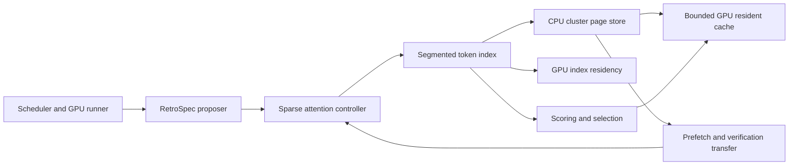

# RetroSpec CPU offload backend

RetroSpec on `version1` keeps cluster pages in CPU memory and uses a bounded
GPU resident cache. The active implementation is under
`vllm/v1/spec_decode/retrospec/offload/`. The runtime controllers remain in
`vllm/v1/spec_decode/retrospec/runtime/`; they enter the backend through
`RetroSpecSegmentedTokenIndex` and its page store.

## Package responsibilities

| Modules under `offload/` | Responsibility |
| --- | --- |
| `segmented_index.py`, `segmented_build.py`, `segmented_selection.py`, `segmented_verification.py`, `segmented_types.py` | Per-request segment state, background index construction, selection plans, indexed verification, and full verification pipeline |
| `cluster_store.py`, `cluster_store_support.py`, `page_pool.py` | Cluster identities and descriptors, CPU page slabs, allocation, staging, and cluster page ownership |
| `cluster_prefetch.py`, `cluster_verification.py`, `verification_transfer.py` | Resident prefetch waves, verification miss resolution, and reusable full-layer transfer buffers |
| `resident_cache.py`, `resident_kernels.py`, `index_residency.py`, `pinned_memory.py` | Bounded resident pages, GPU index arenas and bindings, and shared pinned-memory budget |
| `cluster_scoring.py`, `selection_kernels.py`, `selection_provenance.py` | Cluster scoring, token plan packing and gathering, and replay trace provenance |
| `clustering.py`, `clustering_kernels.py`, `execution.py`, `index.py`, `cluster_identity.py` | Cluster construction, exact and proposal attention kernels, index base types, and stable cluster identity |

## Request lifecycle

1. The scheduler admits requests against the existing GPU index and KV budgets.
   Layer-major prefill passes staged token KV to the segmented index.
2. The index builds per-head clusters and writes their pages to CPU slabs.
   Request and layer revisions identify the segments that may be published.
3. During proposal, the GPU index supplies resident cluster metadata. Scoring
   and selection form bounded exact and estimation plans. The page store
   prefetches selected pages into the resident cache without changing the
   model execution stream or the cache budget.
4. Verification resolves selected misses and transfers full-layer pages with
   reusable buffers. The current and next layers may overlap their transfers
   with model execution. Request removal and failed builds release their
   staged state through the existing lifecycle methods.

The public imports in the parent `retrospec/` package remain compatibility
entries for the original classes, functions, and data types. Their class
qualified paths are preserved for serialization. Runtime code imports the
`offload/` implementation directly. The relocation leaves kernel bodies,
launch arguments, stream order, buffer reuse, KV retirement, configuration
defaults, and memory-budget formulas unchanged.

## Verification

Backend tests are grouped under `tests/retrospec/offload/`; the page store and
segmented index tests are split by responsibility. The full RetroSpec suite
also exercises the unchanged public import paths. Performance configurations,
generated-token comparisons, stage counters, and baseline limitations are
recorded in `benchmarks/retrospec/version1_batch3_results.md`.
